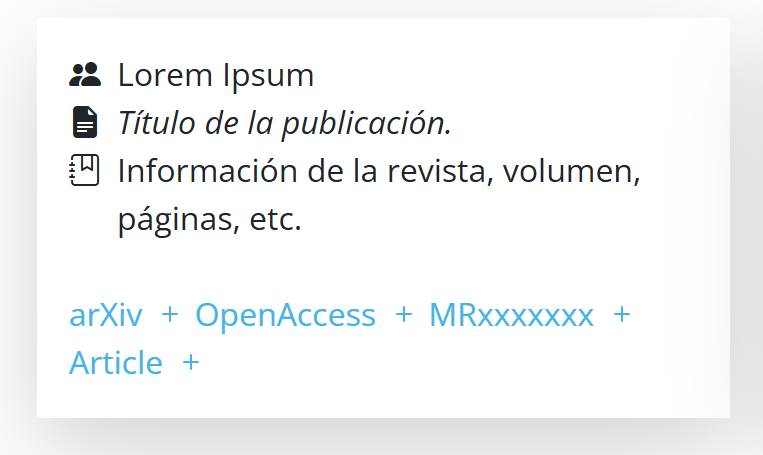
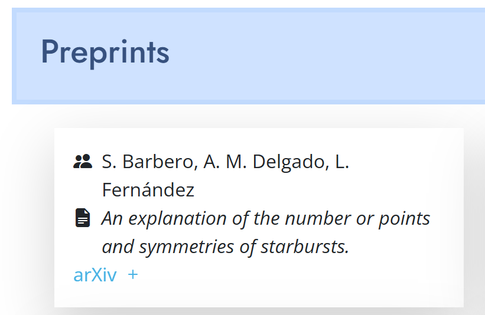
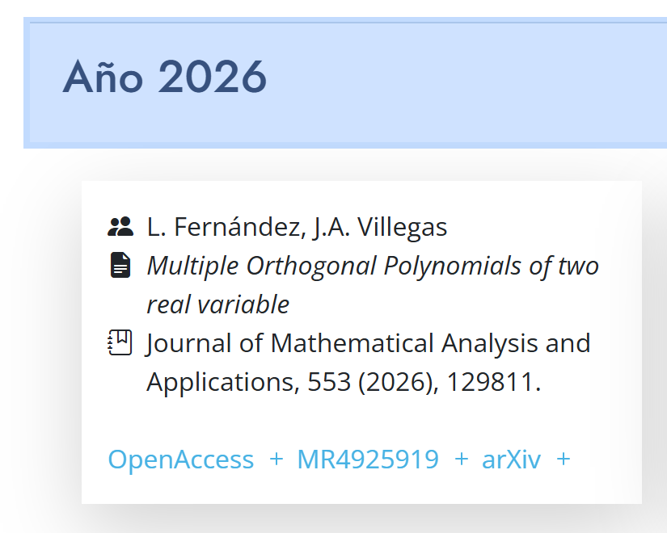
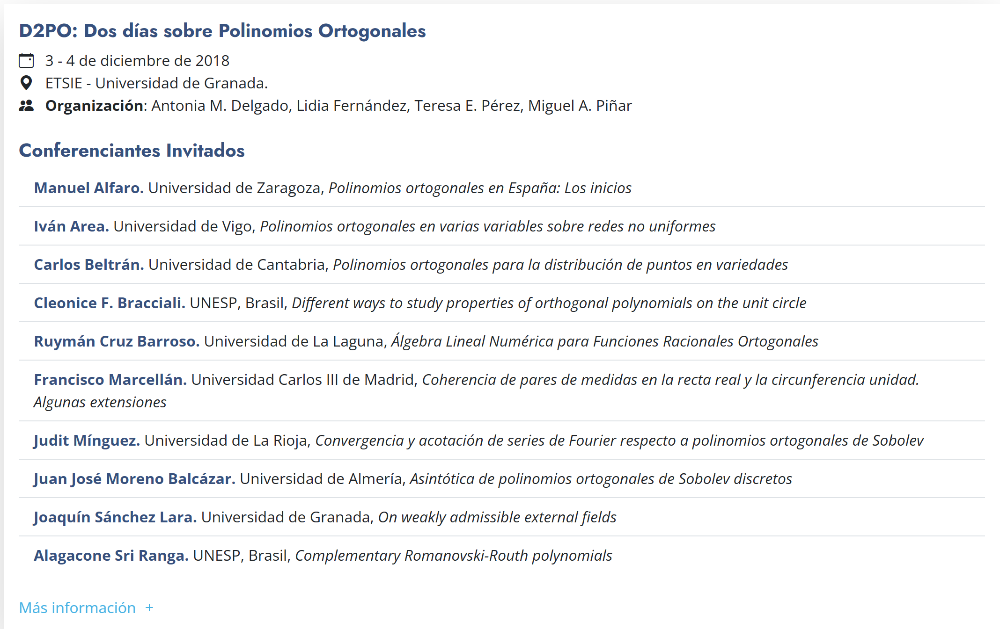
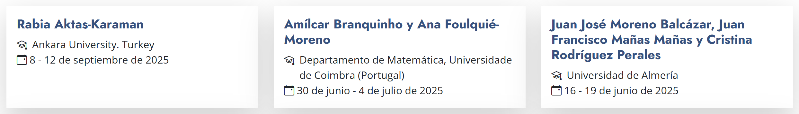
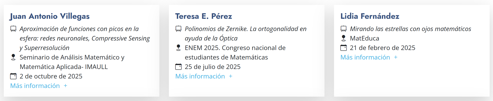
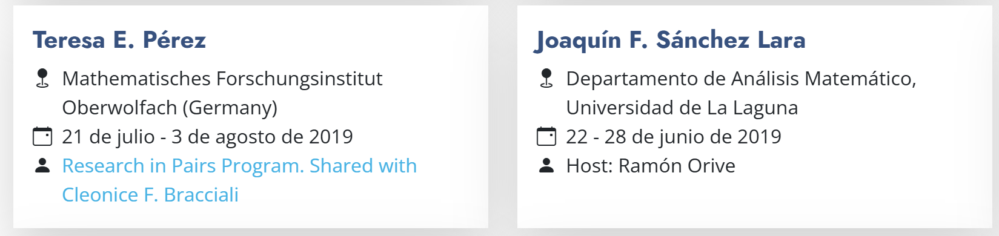
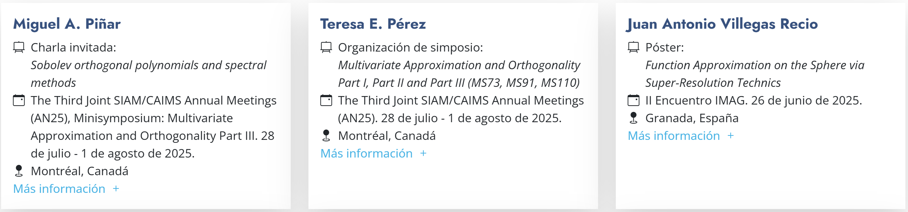

# Web del grupo FQM-384: GOYA

Este es el repositorio donde se almacena toda la información y ficheros relativos a la página web del grupo de investigación de la Junta de Andalucía FQM-384: "GOYA: Grupo de Ortogonalidad Y Aplicaciones". 

En este fichero se explica la metodología utilizada para el desarrollo y la creación de esta web, así como la manera de actualizar su contenido de una manera sencilla.


## Metodología

Para el diseño de esta web se ha utilizado el conocido "Modelo-Vista-Controlador" (MVC), en el cual se separa la parte más visual de la web: sus elementos, diseño, tipografías, colores, etc. (**vista**) de los datos que se muestran, que en este caso son las conferencias, seminarios, publicaciones, etc. (**modelo**). La manera en la que se "controla" el intercambio de información entre el modelo y la vista es mediante lo que llamamos **controlador**. En concreto, hemos utilizado los siguientes elementos:

* Para la vista, hemos utilizado un motor de CSS llamado [Bootstrap](https://getbootstrap.com/docs/5.0/getting-started/introduction/), que nos permite diseñar y distribuir los elementos, así como asignar diseños y animaciones de una manera sencilla. Aún más concretamente, se ha utilizado una plantilla llamada [**Arsha**](https://bootstrapmade.com/arsha-free-bootstrap-html-template-corporate/). Con estas utilidades hemos diseñado el encabezado, las primeras secciones y el pie de página. Para las publicaciones y las actividades realizadas (aquellas secciones que comprenden un mayor volumen de datos y más cambiante), en lugar de escribir la información de una sola vez, en su lugar se han creado plantillas en las que, posteriormente, se introducirían los datos provenientes del modelo. Para la creación de estas plantillas, se ha utilizado el motor de plantillas [**Handlebars**](https://handlebarsjs.com/).

  Pongamos un ejemplo: las publicaciones de los integrantes del grupo. Mediante Bootstrap y la plantilla Arsha podemos crear una 'tarjeta' (card) para almacenar información sobre una publicación, y gracias a Handlebars podemos especificar que en la primera línea van los/as autores/as, en la segunda el título de la publicación, en la tercera la revista, etc.

  


* Para el modelo, podemos encontrar en la carpeta [data](./data/) una serie de ficheros que contienen toda la información sobre publicaciones y actividades llevadas a cabo por el grupo GOYA desde su fundación en el año 2015. Estos ficheros son, en realidad, archivos de **Javascript** donde se crea y exporta una lista de objetos, siendo cada uno de esos objetos un conjunto de pares clave-valor (diccionario) que identifican una actividad, publicación, visita, etc. dependiendo del fichero en particular. Los ficheros y su contenido son los siguientes:
  * [`communications.js`](./data/communications.js): Aportaciones a congresos y eventos científicos: charlas invitadas, conferencias, exposición y/o defensa de póster, organización de simposios, etc. En general, la actividad que se haya podido llevar a cabo en un determinado congreso.
  * [`conferences.js`](./data/conferences.js): Conferencias impartidas en seminarios, estancias o algún tipo de evento.
  * [`publications.js`](./data/publications.js): Publicaciones realizadas por los miembros y miembras del grupo. En este fichero se incluyen tanto las publicaciones ya indexadas en alguna revista, capítulo de libro o similar, como aquellas que aún no han sido publicadas, consideradas 'preprint' o publicaciones que han sido aceptadas pero no indexadas.
  * [`seminars.js`](./data/seminars.js): Información sobre los seminarios GOYA organizados a lo largo de los años.
  * [`stays.js`](./data/stays.js): Estancias de investigación de alguna persona del grupo en una institución distinta de la Universidad de Granada.
  * [`visits.js`](./data/visits.js): Visitas realizadas por personal investigador de alguna otra institución a la Universidad de Granada para llevar a cabo labores de investigación con alguien del grupo.
  * [`workshops.js`](./data/workshops.js): Eventos científicos organizados por el grupo GOYA.

  Como se puede comprobar abriendo cualquiera de los citados ficheros, cada registro tiene una estructura muy marcada, que es la que el controlador utiliza para rellenar las plantillas.

* Por último, el controlador es el puente de unión entre los datos en crudo, presentes en los archivos de la carpeta `data`, y las plantillas de Handlebars del fichero `index.html`. Precisamente mediante Handlebars y programación en JavaScript, ayudados también de la biblioteca [jQuery](https://jquery.com/) (que simplifica la programación web), en el fichero [`scripts.js`](./assets/js/scripts.js) hemos implementado funciones que ordenan cronológicamente los registros de cada categoría, les dan formato, y manipulan todo lo necesario para finalmente escribir los datos en las plantillas en el formato que podemos encontrar en la versión final.

## Cómo incluir nuevos registros

Precisamente por la arquitectura diseñada, para incluir un nuevo registro bastaría con modificar el fichero de la carpeta [`data`](./data/) correspondiente. Para mayor facilidad de todo el mundo, he incluido un mini-tutorial en cada uno de los ficheros, por lo que bastaría con copiar y pegar el bloque base y modificar el contenido. 

<strong style="color:red">:warning: VARIOS DETALLES A TENER EN CUENTA :warning:</strong>

* La arquitectura es muy sensible a la estructura de estos ficheros, y un error como puede ser que simplemente se nos olvide una coma o cerrar unas comillas puede llevar a un fallo en cadena.
* Por este motivo, es importante acordarnos de que todas las cadenas de caracteres que pongamos deben ir entre comillas `"..."`, cada campo que rellenemos debe acabar con una coma `,` y que los objetos van separados por comas, por lo que no podemos olvidar separar por comas ni los campos dentro de cada registro, ni los registros en sí.
* En cada caso he dejado claro los campos que son opcionales y los que no, pero en caso de no rellenar un campo marcado como opcional, en realidad nada fallaría, pero se mostraría su parte respectiva de la plantilla en blanco. De la misma manera, el nombre de los campos (la clave), es importante que se escriba correctamente, ya que javascript es sensible a mayúsculas y minúsculas (no es como bibtex), de ahí que recomiende copiar y pegar el bloque de ejemplo.
* Las fechas que se introduzcan en los nuevos registros deben tener el formato `YYYY-MM-DD`, ya que así se optimiza la ordenación y es algo que no requiere demasiado esfuerzo, además de que posteriormente se redacta correctamente en la vista. Por ejemplo, el 3 de enero de 2026 sería `2026-01-03`.
* El orden en el que se escriben los distintos campos dentro de un registro no es relevante, ni lo es el orden en el que estos se escriban, ya que a posteriori se ordenan cronológicamente, pero sí que conviene llevar cierto orden a la hora de buscar dentro del propio fichero en caso de que fuera necesario.
* Cuando se modifique un fichero para incluir o modificar un registro, se ruega escribir en la cabecera quién hizo la revisión y la fecha, para controlar la última actualización y en caso de producirse algún error, saber localizar más rápidamente la posible fuente de error.
* 
* En caso de necesitar incluir algún campo adicional, o algún comportamiento que no se pueda emular con lo ya implementado

Observad un fragmento del fichero `visits.js` que se puede tomar como referencia para entender estos detalles.

```js
const visits = [
    /* Para añadir una nueva visita, copiar y pegar el siguiente bloque y rellenar los campos correspondientes:
    {
        visitor: "Nombre del visitante",
        affiliation: "Afiliación del visitante",
        startDate: "AAAA-MM-DD",
        endDate: "AAAA-MM-DD"
    },
    */
    // --- 2025 ---
    {
        visitor: "Rabia Aktas-Karaman",
        affiliation: "Ankara University. Turkey",
        startDate: "2025-09-08",
        endDate: "2025-09-12"
    },
    {
        visitor: "Amílcar Branquinho",
        affiliation: "Departamento de Matemática, Universidade de Coimbra (Portugal)",
        startDate: "2025-06-30",
        endDate: "2025-07-04"
    },
    ...
]
```

Cada uno de estas actividades y publicaciones conlleva alguna particularidad, por lo que a continuación se describe una por una las distintas posibilidades, describiendo los campos y los casos especiales.

### Cómo añadir una nueva publicación

El caso de las publicaciones es el más complejo, ya que incluyen los preprint, los artículos aceptados y los ya publicados. La estructura genérica, en la cual se autoexplican los campos es la siguiente:

```js
{
    author: "Autor(es)",
    title: "Título de la publicación.",
    date: 2026, // Año de publicación (si está publicado)
    status: "Preprint" / "Accepted", // Omitir si está publicado
    journal_info: "Información de la revista, volumen, páginas, etc.",
    links: {
        arXiv: "link al preprint en arXiv (si aplica)",
        OpenAccess: "link al artículo de acceso abierto (si aplica)",
        MRxxxxxxx: "link a MathSciNet (si aplica)",
        Article: "link al artículo publicado (si aplica)"
    }
},
```

Los campos a rellenar en cualquier caso son, por tanto: autor/es/as, título de la publicación, año de la publicación (aunque ponga date, con el año basta). En caso de que el artículo esté ya publicado y tengamos la información necesaria por parte de la revista, entonces esta información se incluye en el campo `journal_info` y el campo `status` se deja vacío o directamente se elimina. En caso de que sea un preprint o un artículo ya aceptado, ponemos "Preprint" o "Accepted" según el caso en el campo `status`. Finalmente, en links podemos incluir los diferentes enlaces y accesos al artículo, teniendo en mente que, en este caso, la clave será el texto del enlace, y el valor la URL. 

Mostramos entonces un par de ejemplos (a fecha de diciembre de 2025):

```js
// ─── Preprints ───────────────────────────────────────────────────────
    {
        author: "S. Barbero, A. M. Delgado, L. Fernández",
        title: "An explanation of the number or points and symmetries of starbursts.",
        status: "Preprint",
        links: {
            arXiv: "https://arxiv.org/abs/2507.06170"
        }
    },
// --- Publicaciones 2026 ---
    {
        author: "L. Fernández, J.A. Villegas",
        title: "Multiple Orthogonal Polynomials of two real variable",
        date: 2026,
        journal_info: "Journal of Mathematical Analysis and Applications, 553 (2026), 129811.",
        links: {
            OpenAccess: "https://www.sciencedirect.com/science/article/pii/S0022247X2500592X",
            MR4925919: "https://mathscinet.ams.org/mathscinet/article?mr=4925919",
            arXiv: "https://arxiv.org/abs/2412.09523"
        }
    },
```

Estos dos regitros producen el siguiente output:






### Cómo añadir un nuevo seminario

Los seminarios organizados por el grupo GOYA vienen dados mediante la siguiente estructura:

```js
{
    title: "Título del seminario (opcional)", // Si no se especifica, se usará "Seminario GOYA del día ..."
    date: "YYYY-MM-DD", // Importante: Usar formato ISO para fácil manejo: YYYY-MM-DD
    time: "HH:MM",
    location: "Lugar del seminario",
    links: {
        info: "Enlace con más información sobre el seminario",
        foto: "Enlace a una foto del seminario (opcional)",
        ... // Otros enlaces relevantes
    },
    conferences: [
        {
            speaker: "Nombre del ponente",
            title: "Título de la conferencia",
            link: "Enlace al resumen o material adicional (opcional)"
        }
        // Más conferencias si las hay y separadas por comas
    ]
},
```

En general, salvo que se especifique un título por algún motivo especial (véase D1PO 2018), se tomará la fecha especificada en el campo `date` y se etiquetará como "Seminario GOYA del DD de (mes en español) de YYYY". Se debe incluir la fecha, la hora y el lugar en el que se llevó/llevará a cabo el seminario. El campo `links` cumple un rol similar al que cumplía en el caso de las publicaciones, de manera que se pueden añadir enlaces a información genérica del seminario, a una o varias fotos, etc. Finalmente, el campo `conferences` es una lista de conferencias. A su vez, cada conferencia es un objeto cuyos campos son `speaker`, `title` y `link`, donde para cada conferencia de cada seminario, se escriben el nombre del conferenciante (y la institución de la que viene normalmente), el título de su charla, y un link al abstract o cualquier material relacionado exclusivamente con esa charla concreta. Mostramos a continuación un registro concreto a la vez que representativo:

```js
{
    date: "2024-04-03", 
    time: "12:30",
    location: "Aula A-13, Facultad de Ciencias (UGR)",
    links: {
        info: "https://fciencias.ugr.es/34-noticias/4431-seminario-del-grupo-goya"
    },
    conferences: [
        {
            speaker: "Chelo Ferreira. Universidad de Zaragoza.",
            title: "Técnicas de Mellin de aproximación asintótica: aplicación a la Elastodinámica.",
            link: "https://wpd.ugr.es/~imag/cms/wp-content/uploads/resumen_sem_abril24.pdf"
        },
        {
            speaker: "Juan Antonio Villegas Recio. Universidad de Granada.",
            title: "Avances en la generalización de la ortogonalidad múltiple al caso bivariado.",
            link: "https://wpd.ugr.es/~imag/cms/wp-content/uploads/abstract_b.pdf"
        }
    ]
},
```

que produce el siguiente output:


donde cabe destacar que los títulos de las charlas son enlaces a las URL especificadas.

### Cómo añadir un nuevo evento científico

Cada vez que se organice un evento de mayor magnitud que un seminario GOYA, como sería el caso de un D2PO, un OPSFA o similar, habría que incluir una nueva entrada al fichero [`workshops.js`](./data/workshops.js). El formato genérico de un evento científico es el siguiente:

```js
{
    name: "Nombre del evento",
    startDate: "AAAA-MM-DD",
    endDate: "AAAA-MM-DD",
    location: "Lugar en el que se celebra",
    organizers: "Organizadores y organizadores del evento",
    website_link: "Enlace al sitio web del evento",
    invited_speakers: [
        {
            speaker: "Nombre del ponente",
            university: "Universidad del ponente",
            title: "Título de la ponencia (opcional)"
        },
        // Más ponentes si los hay y separados por comas
    ]
},
```
como se puede ver, cada evento científico se compone de su nombre, la fecha en la que empieza, la fecha en la que termina (en formato `YYYY-MM-DD`), el lugar en el que se celebra, los nombres de los organizadores y organizadoras (que se escriben como una sola cadena de caracteres sin mayor complejidad), un enlace al sitio web del evento, y una lista de conferencias invitadas, donde cada conferencia, a su vez, es un diccionario donde se debe especificar el nombre del speaker, su afiliación, y opcionalmente el título de la conferencia.

Observad el registro correspondiente a la primera edición del D2PO: 
```js
{
    name: "D2PO: Dos días sobre Polinomios Ortogonales",
    startDate: "2018-12-03", 
    endDate: "2018-12-04",
    location: "ETSIE - Universidad de Granada.",
    organizers: "Antonia M. Delgado, Lidia Fernández, Teresa E. Pérez, Miguel A. Piñar",
    website_link: "https://www.ugr.es/~goya/D2PO2018/img/poster-d2po.pdf",
    invited_speakers: [
        {
            speaker: "Manuel Alfaro",
            university: "Universidad de Zaragoza",
            title: "Polinomios ortogonales en España: Los inicios"
        },
        {
            speaker: "Iván Area",
            university: "Universidad de Vigo",
            title: "Polinomios ortogonales en varias variables sobre redes no uniformes"
        },
        {
            speaker: "Carlos Beltrán",
            university: "Universidad de Cantabria",
            title: "Polinomios ortogonales para la distribución de puntos en variedades"
        },
        {
            speaker: "Cleonice F. Bracciali",
            university: "UNESP, Brasil",
            title: "Different ways to study properties of orthogonal polynomials on the unit circle"
        },
        {
            speaker: "Ruymán Cruz Barroso",
            university: "Universidad de La Laguna",
            title: "Álgebra Lineal Numérica para Funciones Racionales Ortogonales"
        },
        {
            speaker: "Francisco Marcellán",
            university: "Universidad Carlos III de Madrid",
            title: "Coherencia de pares de medidas en la recta real y la circunferencia unidad. Algunas extensiones"
        },
        {
            speaker: "Judit Mínguez",
            university: "Universidad de La Rioja",
            title: "Convergencia y acotación de series de Fourier respecto a polinomios ortogonales de Sobolev"
        },
        {
            speaker: "Juan José Moreno Balcázar",
            university: "Universidad de Almería",
            title: "Asintótica de polinomios ortogonales de Sobolev discretos"
        },
        {
            speaker: "Joaquín Sánchez Lara",
            university: "Universidad de Granada",
            title: "On weakly admissible external fields"
        },
        {
            speaker: "Alagacone Sri Ranga",
            university: "UNESP, Brasil",
            title: "Complementary Romanovski-Routh polynomials"
        }
    ]
}
```
que produce el siguiente output:


### Cómo añadir una nueva visita a la UGR

En el fichero [`visits.js`](./data/visits.js) se encuentran los registros de cada uno de las visitas de investigadores externos a la UGR. El formato genérico sería el siguiente:
```js
{
    visitor: "Nombre del visitante",
    affiliation: "Afiliación del visitante",
    startDate: "AAAA-MM-DD",
    endDate: "AAAA-MM-DD"
},
```
Donde se incluye el nombre de la persona (o las personas) que visitan la UGR, su afiliación y las fechas de inicio y fin de su estancia (en formato `YYYY-MM-DD`). Como ejemplo, consultad los siguientes objetos:
```js
{
    visitor: "Rabia Aktas-Karaman",
    affiliation: "Ankara University. Turkey",
    startDate: "2025-09-08",
    endDate: "2025-09-12"
},
{
    visitor: "Amílcar Branquinho y Ana Foulquié-Moreno",
    affiliation: "Departamento de Matemática, Universidade de Coimbra (Portugal)",
    startDate: "2025-06-30",
    endDate: "2025-07-04"
},
{
    visitor: "Juan José Moreno Balcázar, Juan Francisco Mañas Mañas y Cristina Rodríguez Perales",
    affiliation: "Universidad de Almería",
    startDate: "2025-06-16",
    endDate: "2025-06-19"
},
```
que producen la siguiente información:


### Cómo añadir una nueva conferencia impartida

En este apartado, registrado en el fichero [`conferences.js`](./data/conferences.js) encontramos las conferencias impartidas por los y las integrantes del grupo GOYA en seminarios propios o externos, eventos de divulgación, etc. El formato sería el siguiente:
```js
{
    speaker: "Nombre del ponente",
    title: "Título de la conferencia",
    event: "Nombre del evento",
    date: "AAAA-MM-DD",
    link: "Enlace a la conferencia (opcional)"
},
```
Se incluye el nombre de la persona que imparte la conferencia (o nombres en caso de ser una conferencia compartida), el título de la misma, el evento o situación en el que se produjo la conferencia, la fecha (en formato `YYYY-MM-DD`) y el enlace a la conferencia (aunque es opcional). Observad como ejemplo las siguientes conferencias:
```js
{
    speaker: "Juan Antonio Villegas",
    title: "Aproximación de funciones con picos en la esfera: redes neuronales, Compressive Sensing y Superresolución",
    event: "Seminario de Análisis Matemático y Matemática Aplicada- IMAULL",
    date: "2025-10-02",
    link: "https://www.ull.es/portal/agenda/evento/seminario-de-analisis-matematico-y-matematica-aplicada-2025-2026/#1759405018039-f3852b9a-210d"
},
{
    speaker: "Teresa E. Pérez",
    title: "Polinomios de Zernike. La ortogonalidad en ayuda de la Óptica",
    event: "ENEM 2025. Congreso nacional de estudiantes de Matemáticas",
    date: "2025-07-25",
    link: "https://enem.anem.es/2025/"
},
{
    speaker: "Lidia Fernández",
    title: "Mirando las estrellas con ojos matemáticos",
    event: "MatEduca",
    date: "2025-02-21",
    link: "https://www.ugr.es/~mateduca/"
},
```
que produce el siguiente resultado:


### Cómo añadir una nueva estancia en otra institución

Estos serían los registros análogos a las visitas, pero 'hacia afuera', es decir, las estancias de algún miembro del grupo GOYA en alguna institución para llevar a cabo labores de investigación. El formato más genérico es el siguiente, aunque sufre de alguna variación provocada por algunos registros que no encajaban exactamente con el formato:
```js
{
    visitor: "Nombre del visitante",
    place: "Lugar de la estancia",
    startDate: "AAAA-MM-DD",
    endDate: "AAAA-MM-DD",
    host: "Nombre del anfitrión"
},
```
En este sencillo caso, se rellenaría el nombre de la(s) persona(s) que realiza(n) la visita, el lugar o la institución en el que se realiza la estancia, la fecha de inicio y final de la estancia (en formato `YYYY-MM-DD`) y el nombre de (los) host(s) de la visita. Sin embargo, en ocasiones, en lugar de haber una o varias personas haciendo el papel de host, hay un grupo, una actividad, o algo por el estilo. En ese caso, en lugar de rellenar el campo `host`, se incluyen los campos `note` y `link`, donde se describirían estos casos:
```js
{
    visitor: "Nombre del visitante",
    place: "Lugar de la estancia",
    startDate: "AAAA-MM-DD",
    endDate: "AAAA-MM-DD",
    note: "Texto de la nota",
    link: "Enlace asociado a la nota"
},
```
Consultad los siguientes ejemplos:
```js
{
    visitor: "Teresa E. Pérez",
    place: "Mathematisches Forschungsinstitut Oberwolfach (Germany)",
    startDate: "2019-07-21",
    endDate: "2019-08-03",
    note: "Research in Pairs Program. Shared with Cleonice F. Bracciali",
    link: "https://opc.mfo.de/detail?photo_id=23408"
},
{
    visitor: "Joaquín F. Sánchez Lara",
    place: "Departamento de Análisis Matemático, Universidad de La Laguna",
    startDate: "2019-06-22",
    endDate: "2019-06-28",
    host: "Ramón Orive"
},
```
y sus output



### Cómo añadir una nueva aportación a un congreso

En este apartado, registrado en [`communications.js`](./data/communications.js), se incluyen las comunicaciones y aportaciones a congresos. El formato es el siguiente:
```js
{
    author: "Nombre del autor o autores",
    title: "Título de la comunicación / presentación / póster / simposio organizado / ... ",
    type: "Tipo de comunicación (Charla, Póster, Organización de simposio, etc.)",
    event: "Nombre del evento",
    startDate: "YYYY-MM-DD",
    endDate: "YYYY-MM-DD",
    location: "Ubicación del evento",
    link: "Enlace al evento o presentación"
},
```
Aunque el nombre del fichero y el formato de los registros sugieren comunicaciones tipo charla invitada, conferencia plenaria, póster, participación en (mini-)simposio, etc. en realidad también podrían incluirse organizaciones de los propios congresos, de (mini-)simposio, participaciones en el comité, etc. Bastaría con rellenar adecuadamente los campos `type` y  `title`. Obsérvense los siguientes ejemplos:
```js
 {
    author: "Miguel A. Piñar",
    title: "Sobolev orthogonal polynomials and spectral methods",
    type: "Charla invitada",
    event: "The Third Joint SIAM/CAIMS Annual Meetings (AN25), Minisymposium: Multivariate Approximation and Orthogonality Part III",
    startDate: "2025-07-28",
    endDate: "2025-08-01",
    location: "Montréal, Canadá",
    link: "https://meetings.siam.org/sess/dsp_programsess.cfm?SESSIONCODE=84861"
},
{
    author: "Teresa E. Pérez",
    title: "Multivariate Approximation and Orthogonality Part I, Part II and Part III (MS73, MS91, MS110)",
    type: "Organización de simposio",
    event: "The Third Joint SIAM/CAIMS Annual Meetings (AN25)",
    startDate: "2025-07-28",
    endDate: "2025-08-01",
    location: "Montréal, Canadá",
    link: "https://meetings.siam.org/sess/dsp_programsess.cfm?SESSIONCODE=84861"
},
{
    author: "Juan Antonio Villegas Recio",
    title: "Function Approximation on the Sphere via Super-Resolution Technics",
    type: "Póster",
    event: "II Encuentro IMAG",
    startDate: "2025-06-26",
    endDate: "2025-06-26",
    location: "Granada, España",
    link: "https://wpd.ugr.es/~imag/events/event/ii-encuentro-imag/"
},
```
y los correspondientes resultados:


## Información y créditos sobre la plantilla original

Nombre de la plantilla / Template Name: Arsha
URL de la plantilla / Template URL: https://bootstrapmade.com/arsha-free-bootstrap-html-template-corporate/
Autor / Author: BootstrapMade.com
Licencia / License: https://bootstrapmade.com/license/


